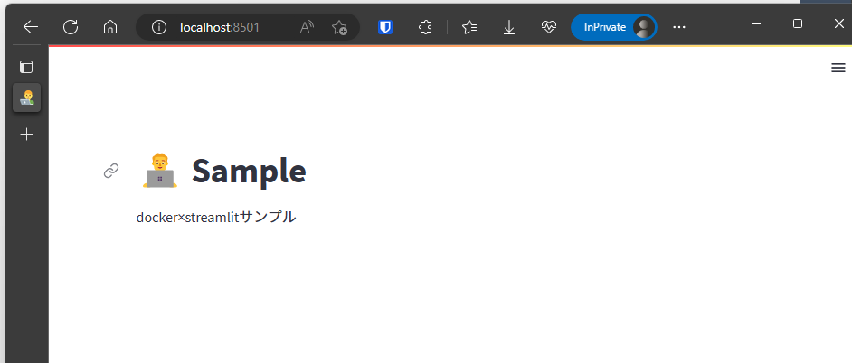

# docker-python-app-sample

Dockerを使ったPythonアプリ開発の環境構築サンプル

## クイックスタート

### 本番環境の起動

```shell
# ビルド
$ docker build . --target app  -t python-sample-app
# アプリの起動
$ docker run -p 8501:8501 python-sample-app
```

<http://localhost:8501/>にアクセス。以下画面が表示されればOK。



### 開発環境へのアクセス

VSCodeのremote-containerにより接続
